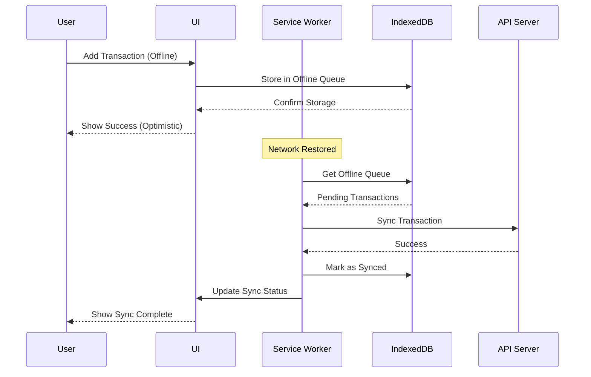

# Design Document: PWA Functionality

## Overview

This design implements Progressive Web App (PWA) functionality for MoneyPilot, a mobile-first fintech application built with Next.js 16. The implementation enables offline-first capabilities, home screen installation, background synchronization, and native-like user experience across iOS and Android devices.

The architecture follows a layered approach:
1. **Service Worker Layer**: Handles caching, offline support, and background sync
2. **Storage Layer**: Manages offline data persistence using IndexedDB
3. **Sync Layer**: Coordinates data synchronization between offline and online states
4. **UI Layer**: Provides user feedback for installation, offline status, and updates

Key design decisions:
- **Workbox for Service Worker**: Using Workbox library instead of custom service worker for reliability and maintenance
- **next-pwa Plugin**: Leveraging next-pwa for seamless Next.js integration and automatic service worker generation
- **IndexedDB via idb**: Using the idb wrapper library for cleaner IndexedDB API
- **Optimistic UI Updates**: Immediate UI feedback for offline actions with background sync
- **Progressive Enhancement**: Core functionality works without PWA features, enhanced when available

## Architecture

### System Architecture

```
┌─────────────────────────────────────────────────────────────┐
│                        Next.js App                          │
│  ┌──────────────┐  ┌──────────────┐  ┌──────────────┐     │
│  │   UI Layer   │  │  API Routes  │  │   Pages      │     │
│  └──────┬───────┘  └──────┬───────┘  └──────┬───────┘     │
│         │                  │                  │              │
│         └──────────────────┴──────────────────┘              │
│                            │                                 │
└────────────────────────────┼─────────────────────────────────┘
                             │
                ┌────────────┴────────────┐
                │                         │
        ┌───────▼────────┐       ┌───────▼────────┐
        │ Service Worker │       │   IndexedDB    │
        │   (Workbox)    │◄──────┤   (idb lib)    │
        └───────┬────────┘       └────────────────┘
                │
        ┌───────┴────────┐
        │  Cache Storage │
        │  - App Shell   │
        │  - Static      │
        │  - API Data    │
        └────────────────┘
```

### Data Flow

**Online Mode:**
```
User Action → UI Component → API Call → Server → Response → UI Update → Cache Update
```

**Offline Mode:**
```
User Action → UI Component → IndexedDB Write → Offline Queue → UI Update (Optimistic)
                                                      ↓
                                            (When Online)
                                                      ↓
                                            Background Sync → Server → Queue Cleanup
```

### Component Interaction



## Components and Interfaces

### 1. Web App Manifest (`public/manifest.json`)

**Purpose**: Provides metadata for PWA installation and appearance.

**Structure**:
```typescript
interface WebAppManifest {
  name: string;              // "MoneyPilot"
  short_name: string;        // "MoneyPilot"
  description: string;       // App description
  start_url: string;         // "/"
  display: "standalone" | "fullscreen" | "minimal-ui" | "browser";
  orientation: "portrait" | "landscape" | "any";
  theme_color: string;       // Hex color matching brand
  background_color: string;  // Splash screen background
  icons: Icon[];            // Array of icon definitions
}

interface Icon {
  src: string;              // Path to icon file
  sizes: string;            // "192x192" or "512x512"
  type: string;             // "image/png"
  purpose?: "any" | "maskable" | "monochrome";
}
```

**Configuration**:
```json
{
  "name": "MoneyPilot",
  "short_name": "MoneyPilot",
  "description": "Your personal finance companion for tracking expenses and managing budgets",
  "start_url": "/",
  "display": "standalone",
  "orientation": "portrait",
  "theme_color": "#10b981",
  "background_color": "#ffffff",
  "icons": [
    {
      "src": "/icons/icon-192x192.png",
      "sizes": "192x192",
      "type": "image/png",
      "purpose": "any"
    },
    {
      "src": "/icons/icon-512x512.png",
      "sizes": "512x512",
      "type": "image/png",
      "purpose": "any"
    },
    {
      "src": "/icons/icon-maskable-512x512.png",
      "sizes": "512x512",
      "type": "image/png",
      "purpose": "maskable"
    }
  ]
}
```

### 2. Service Worker Configuration (`next.config.ts`)

**Purpose**: Configure next-pwa plugin for automatic service worker generation.

**Implementation**:
```typescript
import type { NextConfig } from "next";
import withPWA from "next-pwa";

const nextConfig: NextConfig = {
  // Existing config options
};

export default withPWA({
  dest: "public",
  register: true,
  skipWaiting: true,
  disable: process.env.NODE_ENV === "development",
  runtimeCaching: [
    {
      urlPattern: /^https:\/\/api\.moneypilot\.app\/.*$/,
      handler: "NetworkFirst",
      options: {
        cacheName: "api-cache",
        expiration: {
          maxEntries: 50,
          maxAgeSeconds: 5 * 60, // 5 minutes
        },
        networkTimeoutSeconds: 3,
      },
    },
    {
      urlPattern: /\.(?:js|css|woff2?)$/,
      handler: "CacheFirst",
      options: {
        cacheName: "static-assets",
        expiration: {
          maxEntries: 100,
          maxAgeSeconds: 30 * 24 * 60 * 60, // 30 days
        },
      },
    },
    {
      urlPattern: /\.(?:png|jpg|jpeg|svg|gif|webp)$/,
      handler: "CacheFirst",
      options: {
        cacheName: "image-cache",
        expiration: {
          maxEntries: 60,
          maxAgeSeconds: 30 * 24 * 60 * 60, // 30 days
        },
      },
    },
  ],
})(nextConfig);
```

### 3. Offline Storage Manager (`src/lib/offline-storage.ts`)

**Purpose**: Manages IndexedDB operations for offline data persistence.

**Interface**:
```typescript
interface OfflineTransaction {
  id: string;                    // UUID
  type: "income" | "expense";
  amount: number;
  category: string;
  description: string;
  date: string;                  // ISO 8601
  createdAt: number;             // Timestamp
  syncStatus: "pending" | "synced" | "failed";
  retryCount: number;
  lastError?: string;
}

interface OfflineStorageManager {
  // Initialize database
  init(): Promise<void>;
  
  // Transaction operations
  addTransaction(transaction: Omit<OfflineTransaction, "id" | "createdAt" | "syncStatus" | "retryCount">): Promise<string>;
  getTransaction(id: string): Promise<OfflineTransaction | undefined>;
  getAllTransactions(): Promise<OfflineTransaction[]>;
  getPendingTransactions(): Promise<OfflineTransaction[]>;
  updateTransactionSyncStatus(id: string, status: OfflineTransaction["syncStatus"], error?: string): Promise<void>;
  deleteTransaction(id: string): Promise<void>;
  
  // Queue management
  getQueueSize(): Promise<number>;
  clearSyncedTransactions(): Promise<void>;
  
  // Storage management
  getStorageEstimate(): Promise<{ usage: number; quota: number }>;
  clearOldData(daysToKeep: number): Promise<number>;
}
```

**Implementation Pattern**:
```typescript
import { openDB, DBSchema, IDBPDatabase } from "idb";

interface MoneyPilotDB extends DBSchema {
  transactions: {
    key: string;
    value: OfflineTransaction;
    indexes: {
      "by-sync-status": string;
      "by-created-at": number;
    };
  };
  metadata: {
    key: string;
    value: unknown;
  };
}

class OfflineStorageManagerImpl implements OfflineStorageManager {
  private db: IDBPDatabase<MoneyPilotDB> | null = null;
  private readonly DB_NAME = "moneypilot-db";
  private readonly DB_VERSION = 1;
  
  async init(): Promise<void> {
    this.db = await openDB<MoneyPilotDB>(this.DB_NAME, this.DB_VERSION, {
      upgrade(db) {
        // Create transactions store
        const txStore = db.createObjectStore("transactions", { keyPath: "id" });
        txStore.createIndex("by-sync-status", "syncStatus");
        txStore.createIndex("by-created-at", "createdAt");
        
        // Create metadata store
        db.createObjectStore("metadata");
      },
    });
  }
  
  // Implementation of interface methods...
}

export const offlineStorage = new OfflineStorageManagerImpl();
```

### 4. Background Sync Manager (`src/lib/background-sync.ts`)

**Purpose**: Coordinates synchronization of offline data when connectivity is restored.

**Interface**:
```typescript
interface BackgroundSyncManager {
  // Register sync event
  registerSync(tag: string): Promise<void>;
  
  // Process offline queue
  processOfflineQueue(): Promise<SyncResult>;
  
  // Sync single transaction
  syncTransaction(transaction: OfflineTransaction): Promise<boolean>;
  
  // Get sync status
  getSyncStatus(): SyncStatus;
  
  // Event listeners
  onSyncStart(callback: () => void): void;
  onSyncComplete(callback: (result: SyncResult) => void): void;
  onSyncError(callback: (error: Error) => void): void;
}

interface SyncResult {
  total: number;
  synced: number;
  failed: number;
  errors: Array<{ id: string; error: string }>;
}

interface SyncStatus {
  isSyncing: boolean;
  lastSyncTime: number | null;
  pendingCount: number;
}
```

**Implementation Pattern**:
```typescript
class BackgroundSyncManagerImpl implements BackgroundSyncManager {
  private syncStatus: SyncStatus = {
    isSyncing: false,
    lastSyncTime: null,
    pendingCount: 0,
  };
  
  private listeners = {
    onStart: [] as Array<() => void>,
    onComplete: [] as Array<(result: SyncResult) => void>,
    onError: [] as Array<(error: Error) => void>,
  };
  
  async registerSync(tag: string): Promise<void> {
    if ("serviceWorker" in navigator && "sync" in ServiceWorkerRegistration.prototype) {
      const registration = await navigator.serviceWorker.ready;
      await registration.sync.register(tag);
    } else {
      // Fallback: immediate sync
      await this.processOfflineQueue();
    }
  }
  
  async processOfflineQueue(): Promise<SyncResult> {
    this.syncStatus.isSyncing = true;
    this.notifyListeners("onStart");
    
    const result: SyncResult = {
      total: 0,
      synced: 0,
      failed: 0,
      errors: [],
    };
    
    try {
      const pending = await offlineStorage.getPendingTransactions();
      result.total = pending.length;
      
      for (const transaction of pending) {
        const success = await this.syncTransaction(transaction);
        if (success) {
          result.synced++;
        } else {
          result.failed++;
          result.errors.push({
            id: transaction.id,
            error: transaction.lastError || "Unknown error",
          });
        }
      }
      
      this.syncStatus.lastSyncTime = Date.now();
      this.syncStatus.pendingCount = result.failed;
      this.notifyListeners("onComplete", result);
    } catch (error) {
      this.notifyListeners("onError", error as Error);
    } finally {
      this.syncStatus.isSyncing = false;
    }
    
    return result;
  }
  
  async syncTransaction(transaction: OfflineTransaction): Promise<boolean> {
    const MAX_RETRIES = 3;
    
    if (transaction.retryCount >= MAX_RETRIES) {
      await offlineStorage.updateTransactionSyncStatus(
        transaction.id,
        "failed",
        "Maximum retry attempts exceeded"
      );
      return false;
    }
    
    try {
      // Call API to sync transaction
      const response = await fetch("/api/transactions", {
        method: "POST",
        headers: { "Content-Type": "application/json" },
        body: JSON.stringify({
          type: transaction.type,
          amount: transaction.amount,
          category: transaction.category,
          description: transaction.description,
          date: transaction.date,
        }),
      });
      
      if (!response.ok) {
        throw new Error(`API error: ${response.status}`);
      }
      
      await offlineStorage.updateTransactionSyncStatus(transaction.id, "synced");
      return true;
    } catch (error) {
      const errorMessage = error instanceof Error ? error.message : "Unknown error";
      await offlineStorage.updateTransactionSyncStatus(
        transaction.id,
        "pending",
        errorMessage
      );
      return false;
    }
  }
  
  // Event listener implementations...
}

export const backgroundSync = new BackgroundSyncManagerImpl();
```

### 5. Install Prompt Component (`src/components/install-prompt.tsx`)

**Purpose**: Provides custom UI for PWA installation.

**Interface**:
```typescript
interface InstallPromptProps {
  onInstall?: () => void;
  onDismiss?: () => void;
}

interface InstallPromptState {
  isVisible: boolean;
  deferredPrompt: BeforeInstallPromptEvent | null;
  isInstalled: boolean;
}
```

**Implementation Pattern**:
```typescript
"use client";

import { useState, useEffect } from "react";
import { X, Download } from "lucide-react";

interface BeforeInstallPromptEvent extends Event {
  prompt(): Promise<void>;
  userChoice: Promise<{ outcome: "accepted" | "dismissed" }>;
}

export function InstallPrompt({ onInstall, onDismiss }: InstallPromptProps) {
  const [state, setState] = useState<InstallPromptState>({
    isVisible: false,
    deferredPrompt: null,
    isInstalled: false,
  });
  
  useEffect(() => {
    // Check if already installed
    const isStandalone = window.matchMedia("(display-mode: standalone)").matches;
    if (isStandalone) {
      setState(prev => ({ ...prev, isInstalled: true }));
      return;
    }
    
    // Check if dismissed recently
    const dismissedAt = localStorage.getItem("pwa-install-dismissed");
    if (dismissedAt) {
      const daysSinceDismiss = (Date.now() - parseInt(dismissedAt)) / (1000 * 60 * 60 * 24);
      if (daysSinceDismiss < 7) {
        return;
      }
    }
    
    // Listen for install prompt
    const handleBeforeInstallPrompt = (e: Event) => {
      e.preventDefault();
      const promptEvent = e as BeforeInstallPromptEvent;
      setState(prev => ({
        ...prev,
        deferredPrompt: promptEvent,
        isVisible: true,
      }));
    };
    
    window.addEventListener("beforeinstallprompt", handleBeforeInstallPrompt);
    
    return () => {
      window.removeEventListener("beforeinstallprompt", handleBeforeInstallPrompt);
    };
  }, []);
  
  const handleInstall = async () => {
    if (!state.deferredPrompt) return;
    
    await state.deferredPrompt.prompt();
    const { outcome } = await state.deferredPrompt.userChoice;
    
    if (outcome === "accepted") {
      onInstall?.();
    }
    
    setState(prev => ({ ...prev, isVisible: false, deferredPrompt: null }));
  };
  
  const handleDismiss = () => {
    localStorage.setItem("pwa-install-dismissed", Date.now().toString());
    setState(prev => ({ ...prev, isVisible: false }));
    onDismiss?.();
  };
  
  if (!state.isVisible || state.isInstalled) {
    return null;
  }
  
  return (
    <div className="fixed bottom-4 left-4 right-4 bg-white dark:bg-gray-800 rounded-lg shadow-lg p-4 border border-gray-200 dark:border-gray-700 z-50">
      <button
        onClick={handleDismiss}
        className="absolute top-2 right-2 text-gray-400 hover:text-gray-600 dark:hover:text-gray-300"
        aria-label="Dismiss"
      >
        <X className="w-5 h-5" />
      </button>
      
      <div className="flex items-start gap-3 pr-6">
        <div className="flex-shrink-0 w-12 h-12 bg-primary/10 rounded-lg flex items-center justify-center">
          <Download className="w-6 h-6 text-primary" />
        </div>
        
        <div className="flex-1">
          <h3 className="font-semibold text-gray-900 dark:text-white mb-1">
            Install MoneyPilot
          </h3>
          <p className="text-sm text-gray-600 dark:text-gray-400 mb-3">
            Add to your home screen for quick access and offline use
          </p>
          
          <button
            onClick={handleInstall}
            className="w-full bg-primary text-white px-4 py-2 rounded-lg font-medium hover:bg-primary/90 transition-colors"
          >
            Install App
          </button>
        </div>
      </div>
    </div>
  );
}
```

### 6. Offline Indicator Component (`src/components/offline-indicator.tsx`)

**Purpose**: Displays connection status and sync progress.

**Interface**:
```typescript
interface OfflineIndicatorProps {
  className?: string;
}

interface OfflineIndicatorState {
  isOnline: boolean;
  isSyncing: boolean;
  pendingCount: number;
  lastSyncTime: number | null;
  syncError: string | null;
}
```

**Implementation Pattern**:
```typescript
"use client";

import { useState, useEffect } from "react";
import { WifiOff, Wifi, RefreshCw, AlertCircle, CheckCircle } from "lucide-react";
import { backgroundSync } from "@/lib/background-sync";
import { offlineStorage } from "@/lib/offline-storage";

export function OfflineIndicator({ className }: OfflineIndicatorProps) {
  const [state, setState] = useState<OfflineIndicatorState>({
    isOnline: typeof navigator !== "undefined" ? navigator.onLine : true,
    isSyncing: false,
    pendingCount: 0,
    lastSyncTime: null,
    syncError: null,
  });
  
  const [showSuccess, setShowSuccess] = useState(false);
  
  useEffect(() => {
    // Update online status
    const handleOnline = () => {
      setState(prev => ({ ...prev, isOnline: true }));
      backgroundSync.registerSync("sync-transactions");
    };
    
    const handleOffline = () => {
      setState(prev => ({ ...prev, isOnline: false }));
    };
    
    window.addEventListener("online", handleOnline);
    window.addEventListener("offline", handleOffline);
    
    // Listen to sync events
    backgroundSync.onSyncStart(() => {
      setState(prev => ({ ...prev, isSyncing: true, syncError: null }));
    });
    
    backgroundSync.onSyncComplete((result) => {
      setState(prev => ({
        ...prev,
        isSyncing: false,
        pendingCount: result.failed,
        lastSyncTime: Date.now(),
        syncError: result.failed > 0 ? `${result.failed} items failed to sync` : null,
      }));
      
      if (result.failed === 0 && result.synced > 0) {
        setShowSuccess(true);
        setTimeout(() => setShowSuccess(false), 3000);
      }
    });
    
    backgroundSync.onSyncError((error) => {
      setState(prev => ({
        ...prev,
        isSyncing: false,
        syncError: error.message,
      }));
    });
    
    // Update pending count
    const updatePendingCount = async () => {
      const count = await offlineStorage.getQueueSize();
      setState(prev => ({ ...prev, pendingCount: count }));
    };
    
    updatePendingCount();
    const interval = setInterval(updatePendingCount, 5000);
    
    return () => {
      window.removeEventListener("online", handleOnline);
      window.removeEventListener("offline", handleOffline);
      clearInterval(interval);
    };
  }, []);
  
  // Don't show if online and nothing pending
  if (state.isOnline && state.pendingCount === 0 && !state.isSyncing && !showSuccess) {
    return null;
  }
  
  return (
    <div className={`fixed top-4 right-4 z-40 ${className}`}>
      {/* Offline indicator */}
      {!state.isOnline && (
        <div className="bg-orange-500 text-white px-4 py-2 rounded-lg shadow-lg flex items-center gap-2">
          <WifiOff className="w-4 h-4" />
          <span className="text-sm font-medium">
            Offline {state.pendingCount > 0 && `(${state.pendingCount} pending)`}
          </span>
        </div>
      )}
      
      {/* Syncing indicator */}
      {state.isSyncing && (
        <div className="bg-blue-500 text-white px-4 py-2 rounded-lg shadow-lg flex items-center gap-2">
          <RefreshCw className="w-4 h-4 animate-spin" />
          <span className="text-sm font-medium">Syncing...</span>
        </div>
      )}
      
      {/* Success indicator */}
      {showSuccess && (
        <div className="bg-green-500 text-white px-4 py-2 rounded-lg shadow-lg flex items-center gap-2">
          <CheckCircle className="w-4 h-4" />
          <span className="text-sm font-medium">All synced!</span>
        </div>
      )}
      
      {/* Error indicator */}
      {state.syncError && !state.isSyncing && (
        <div className="bg-red-500 text-white px-4 py-2 rounded-lg shadow-lg flex items-center gap-2">
          <AlertCircle className="w-4 h-4" />
          <span className="text-sm font-medium">{state.syncError}</span>
        </div>
      )}
    </div>
  );
}
```

### 7. Service Worker Registration (`src/app/layout.tsx`)

**Purpose**: Register service worker and link manifest in the app layout.

**Implementation**:
```typescript
import type { Metadata } from "next";
import { InstallPrompt } from "@/components/install-prompt";
import { OfflineIndicator } from "@/components/offline-indicator";

export const metadata: Metadata = {
  title: "MoneyPilot",
  description: "Your personal finance companion",
  manifest: "/manifest.json",
  themeColor: "#10b981",
  appleWebApp: {
    capable: true,
    statusBarStyle: "default",
    title: "MoneyPilot",
  },
};

export default function RootLayout({
  children,
}: {
  children: React.ReactNode;
}) {
  return (
    <html lang="en">
      <head>
        <link rel="apple-touch-icon" href="/icons/icon-192x192.png" />
      </head>
      <body>
        {children}
        <InstallPrompt />
        <OfflineIndicator />
      </body>
    </html>
  );
}
```

## Data Models

### OfflineTransaction Model

```typescript
interface OfflineTransaction {
  // Unique identifier (UUID v4)
  id: string;
  
  // Transaction details
  type: "income" | "expense";
  amount: number;              // In cents to avoid floating point issues
  category: string;
  description: string;
  date: string;                // ISO 8601 format
  
  // Sync metadata
  createdAt: number;           // Unix timestamp (milliseconds)
  syncStatus: "pending" | "synced" | "failed";
  retryCount: number;          // Number of sync attempts
  lastError?: string;          // Error message from last failed sync
}
```

**Validation Rules**:
- `id`: Must be valid UUID v4
- `amount`: Must be positive integer
- `category`: Must be non-empty string
- `date`: Must be valid ISO 8601 date string
- `retryCount`: Must be between 0 and 3
- `syncStatus`: Must be one of the three allowed values

### CacheEntry Model

```typescript
interface CacheEntry {
  url: string;                 // Request URL
  response: Response;          // Cached response
  timestamp: number;           // When cached (Unix timestamp)
  expiresAt: number;          // Expiration time (Unix timestamp)
  strategy: "CacheFirst" | "NetworkFirst" | "StaleWhileRevalidate";
}
```

### SyncQueueItem Model

```typescript
interface SyncQueueItem {
  id: string;                  // UUID
  operation: "create" | "update" | "delete";
  resource: "transaction" | "budget" | "category";
  data: unknown;               // Operation-specific data
  timestamp: number;           // When queued
  priority: number;            // 1-10, higher = more important
}
```

## Data Models


## Correctness Properties

*A property is a characteristic or behavior that should hold true across all valid executions of a system—essentially, a formal statement about what the system should do. Properties serve as the bridge between human-readable specifications and machine-verifiable correctness guarantees.*

### Property Reflection

After analyzing all acceptance criteria, I've identified the following testable properties. Many criteria are specific examples or configuration checks that don't require property-based testing. The properties below focus on universal behaviors that should hold across all inputs:

**Redundancy Analysis:**
- Properties 3.1 and 3.2 (offline storage and retrieval) can be combined into a single round-trip property
- Properties 2.3 and 8.3 both test cache-first strategy for static assets - combined into one
- Properties 2.4 and 8.4 both test network-first strategy for APIs - combined into one
- Properties 4.2 and 4.8 (process all queue items in order) are related and combined
- Properties 6.3 and offline queue size are testing the same underlying behavior

### Core Properties

**Property 1: Offline Storage Round Trip**

*For any* valid transaction data, storing it in IndexedDB while offline and then retrieving it should return equivalent data with the required metadata fields (timestamp, syncStatus, retryCount).

**Validates: Requirements 3.1, 3.2, 3.4**

**Property 2: Cache-First Strategy for Static Assets**

*For any* static asset request (JS, CSS, fonts, images), when the asset exists in cache, the Service Worker should serve it from cache without making a network request, and the response time should be under 100ms.

**Validates: Requirements 2.3, 8.3**

**Property 3: Network-First with Timeout for API Calls**

*For any* API endpoint request, the Service Worker should attempt network first with a 3-second timeout, and if the timeout is exceeded and cached data exists, it should serve the cached response.

**Validates: Requirements 2.4, 8.4, 8.5**

**Property 4: LRU Cache Eviction**

*For any* cache that exceeds its size limit, the Service Worker should remove the least recently used entries first, maintaining the most recently accessed items.

**Validates: Requirements 2.8**

**Property 5: Offline Queue Processing Order**

*For any* set of offline transactions in the queue, when background sync executes, all items should be processed in chronological order (oldest first) based on their creation timestamp.

**Validates: Requirements 4.2, 4.8**

**Property 6: Successful Sync Removes from Queue**

*For any* offline transaction that syncs successfully to the server, the transaction should be removed from the offline queue and marked with syncStatus "synced".

**Validates: Requirements 4.3**

**Property 7: Exponential Backoff for Failed Syncs**

*For any* offline transaction that fails to sync, the retry delay should increase exponentially (e.g., 1s, 2s, 4s) up to a maximum of 3 retry attempts.

**Validates: Requirements 4.4, 4.6**

**Property 8: Storage Quota Enforcement**

*For any* attempt to store data in IndexedDB, when the 50MB quota is exceeded, the system should remove the oldest synced transactions first until sufficient space is available.

**Validates: Requirements 3.8**

**Property 9: Offline Response Status Codes**

*For any* cached page or resource, when requested while offline, the Service Worker should return a 200 status code (not 404 or network error).

**Validates: Requirements 9.3**

**Property 10: Cache Version Cleanup**

*For any* new cache version activation, all old cache versions should be deleted, leaving only the current version in cache storage.

**Validates: Requirements 8.8**

**Property 11: Notification Preference Respect**

*For any* push notification event, if the user has disabled notifications in preferences, the notification should not be displayed.

**Validates: Requirements 10.7**

**Property 12: Pending Count Display Accuracy**

*For any* number of pending offline transactions, the offline indicator should display the exact count of items with syncStatus "pending".

**Validates: Requirements 6.3**

**Property 13: App Shell Load Time from Cache**

*For any* repeat visit to the application, when the app shell is served from cache, the load time should be under 1 second.

**Validates: Requirements 8.2**

## Error Handling

### Service Worker Errors

**Registration Failures**:
- If service worker registration fails, log the error to console and continue without PWA features
- Display a non-intrusive message to the user: "Some offline features are unavailable"
- Retry registration on next page load
- Fallback: App functions normally without offline support

**Update Failures**:
- If service worker update fails, log the error and retry on next app launch
- Don't block the user from using the current version
- Display error in developer console with details
- Provide manual update option in settings

**Cache Failures**:
- If cache write fails, log error but don't block the request
- Serve from network as fallback
- If cache read fails, always attempt network request
- Clear corrupted cache and rebuild on next visit

### IndexedDB Errors

**Storage Quota Exceeded**:
- Attempt to free space by removing oldest synced transactions
- If still insufficient, notify user: "Storage full. Please sync and clear old data."
- Provide UI to manually clear old transactions
- Log the error with current storage usage

**Database Open Failures**:
- Retry with exponential backoff (3 attempts)
- If all retries fail, disable offline features gracefully
- Notify user: "Offline storage unavailable. Data will not be saved offline."
- Continue with online-only mode

**Transaction Failures**:
- Rollback the transaction
- Log the error with transaction details
- Notify user: "Failed to save offline. Please try again."
- Don't lose user's data - keep in memory for retry

### Network Errors

**Sync Failures**:
- Implement exponential backoff: 1s, 2s, 4s delays
- Maximum 3 retry attempts per transaction
- After max retries, mark as "failed" and notify user
- Provide manual retry option in UI
- Log detailed error information for debugging

**Timeout Handling**:
- API requests timeout after 3 seconds
- Serve stale cache data if available
- Display indicator: "Showing cached data (last updated: timestamp)"
- Retry in background when network improves

**Connection Loss During Sync**:
- Pause sync operation immediately
- Don't mark items as failed
- Resume sync when connection restored
- Preserve retry count across connection losses

### Platform-Specific Errors

**iOS Limitations**:
- Background sync not supported: Use visibility change events as fallback
- Limited cache storage: Implement more aggressive cache cleanup
- No install prompt: Show manual install instructions
- Service worker restrictions: Test thoroughly and provide fallbacks

**Android Variations**:
- Handle different Chrome versions gracefully
- Test on various Android versions (8.0+)
- Handle manufacturer-specific PWA quirks
- Provide fallbacks for older Android versions

### User-Facing Error Messages

**Error Message Principles**:
- Clear and actionable
- Non-technical language
- Suggest next steps
- Don't block critical functionality

**Example Messages**:
- "You're offline. Changes will sync when you're back online."
- "Sync failed. Tap to retry."
- "Storage full. Clear old transactions in Settings."
- "Update available. Tap to refresh."

## Testing Strategy

### Dual Testing Approach

This feature requires both unit tests and property-based tests for comprehensive coverage:

**Unit Tests**: Focus on specific examples, edge cases, error conditions, and integration points
**Property Tests**: Verify universal properties across all inputs using randomized testing

Both approaches are complementary and necessary. Unit tests catch concrete bugs in specific scenarios, while property tests verify general correctness across a wide range of inputs.

### Property-Based Testing Configuration

**Library Selection**: Use `fast-check` for TypeScript/JavaScript property-based testing

**Configuration**:
- Minimum 100 iterations per property test (due to randomization)
- Each property test must reference its design document property
- Tag format: `// Feature: pwa-functionality, Property {number}: {property_text}`

**Example Property Test Structure**:
```typescript
import fc from "fast-check";

// Feature: pwa-functionality, Property 1: Offline Storage Round Trip
describe("Offline Storage Round Trip", () => {
  it("should preserve transaction data through store and retrieve cycle", async () => {
    await fc.assert(
      fc.asyncProperty(
        fc.record({
          type: fc.constantFrom("income", "expense"),
          amount: fc.integer({ min: 1, max: 1000000 }),
          category: fc.string({ minLength: 1, maxLength: 50 }),
          description: fc.string({ minLength: 1, maxLength: 200 }),
          date: fc.date().map(d => d.toISOString()),
        }),
        async (transactionData) => {
          // Store transaction
          const id = await offlineStorage.addTransaction(transactionData);
          
          // Retrieve transaction
          const retrieved = await offlineStorage.getTransaction(id);
          
          // Verify data integrity
          expect(retrieved).toBeDefined();
          expect(retrieved!.type).toBe(transactionData.type);
          expect(retrieved!.amount).toBe(transactionData.amount);
          expect(retrieved!.category).toBe(transactionData.category);
          expect(retrieved!.description).toBe(transactionData.description);
          expect(retrieved!.date).toBe(transactionData.date);
          
          // Verify metadata fields exist
          expect(retrieved!.createdAt).toBeGreaterThan(0);
          expect(retrieved!.syncStatus).toBe("pending");
          expect(retrieved!.retryCount).toBe(0);
        }
      ),
      { numRuns: 100 }
    );
  });
});
```

### Unit Testing Strategy

**Focus Areas**:
1. **Manifest Validation**: Verify all required fields exist with correct values
2. **Service Worker Registration**: Test registration success and error handling
3. **Install Prompt Flow**: Test prompt display, acceptance, and dismissal
4. **Offline Indicator States**: Test all indicator states (offline, syncing, error, success)
5. **Update Notifications**: Test update detection and user interaction
6. **Platform Detection**: Test iOS vs Android detection and behavior
7. **Error Scenarios**: Test all error handling paths

**Example Unit Tests**:
```typescript
describe("Web App Manifest", () => {
  it("should have all required fields", async () => {
    const manifest = await fetch("/manifest.json").then(r => r.json());
    
    expect(manifest.name).toBe("MoneyPilot");
    expect(manifest.short_name).toBe("MoneyPilot");
    expect(manifest.display).toBe("standalone");
    expect(manifest.orientation).toBe("portrait");
    expect(manifest.start_url).toBe("/");
    expect(manifest.theme_color).toMatch(/^#[0-9a-f]{6}$/i);
    expect(manifest.background_color).toMatch(/^#[0-9a-f]{6}$/i);
  });
  
  it("should include required icon sizes", async () => {
    const manifest = await fetch("/manifest.json").then(r => r.json());
    
    const sizes = manifest.icons.map(icon => icon.sizes);
    expect(sizes).toContain("192x192");
    expect(sizes).toContain("512x512");
  });
  
  it("should include at least one maskable icon", async () => {
    const manifest = await fetch("/manifest.json").then(r => r.json());
    
    const maskableIcons = manifest.icons.filter(icon => 
      icon.purpose?.includes("maskable")
    );
    expect(maskableIcons.length).toBeGreaterThan(0);
  });
});

describe("Install Prompt", () => {
  it("should not show if already installed", () => {
    // Mock standalone mode
    Object.defineProperty(window, "matchMedia", {
      value: jest.fn().mockImplementation(query => ({
        matches: query === "(display-mode: standalone)",
      })),
    });
    
    const { container } = render(<InstallPrompt />);
    expect(container.firstChild).toBeNull();
  });
  
  it("should not show if dismissed within 7 days", () => {
    const sixDaysAgo = Date.now() - (6 * 24 * 60 * 60 * 1000);
    localStorage.setItem("pwa-install-dismissed", sixDaysAgo.toString());
    
    const { container } = render(<InstallPrompt />);
    expect(container.firstChild).toBeNull();
  });
});

describe("Offline Indicator", () => {
  it("should show offline state when navigator.onLine is false", () => {
    Object.defineProperty(navigator, "onLine", { value: false });
    
    const { getByText } = render(<OfflineIndicator />);
    expect(getByText(/offline/i)).toBeInTheDocument();
  });
  
  it("should show pending count when transactions are queued", async () => {
    // Mock offline storage
    jest.spyOn(offlineStorage, "getQueueSize").mockResolvedValue(5);
    
    const { findByText } = render(<OfflineIndicator />);
    expect(await findByText(/5 pending/i)).toBeInTheDocument();
  });
});
```

### Integration Testing

**Service Worker Integration**:
- Test service worker lifecycle (install, activate, fetch)
- Test cache strategies with real network requests
- Test offline functionality end-to-end
- Test background sync with simulated network changes

**IndexedDB Integration**:
- Test database initialization and upgrades
- Test concurrent read/write operations
- Test quota management and cleanup
- Test data migration scenarios

**Cross-Component Integration**:
- Test offline transaction flow: UI → Storage → Sync → UI update
- Test install flow: Prompt → User action → Installation → UI update
- Test update flow: Detection → Notification → User action → Activation

### Performance Testing

**Metrics to Measure**:
- First Contentful Paint (FCP) < 1.5s
- Time to Interactive (TTI) < 3s on 3G
- Cache hit rate > 90% for repeat visits
- Service worker script size < 50KB
- IndexedDB operation time < 50ms

**Tools**:
- Lighthouse CI for automated PWA audits
- Chrome DevTools for performance profiling
- WebPageTest for network throttling tests
- Custom performance marks for critical paths

### Manual Testing Checklist

**iOS Testing** (Safari 15+):
- [ ] Install to home screen works
- [ ] Offline functionality works
- [ ] App shell loads from cache
- [ ] Splash screen displays correctly
- [ ] Status bar styling is correct
- [ ] Viewport is sized correctly

**Android Testing** (Chrome 90+):
- [ ] Install prompt appears
- [ ] Install to home screen works
- [ ] Offline functionality works
- [ ] Background sync works
- [ ] Push notifications work (future)
- [ ] Update flow works

**Lighthouse PWA Audit**:
- [ ] Score: 100%
- [ ] All PWA criteria met
- [ ] No console errors
- [ ] HTTPS in production

### Test Data Generators

For property-based tests, use these generators:

```typescript
// Transaction generator
const transactionArb = fc.record({
  type: fc.constantFrom("income", "expense"),
  amount: fc.integer({ min: 1, max: 1000000 }),
  category: fc.string({ minLength: 1, maxLength: 50 }),
  description: fc.string({ minLength: 1, maxLength: 200 }),
  date: fc.date({ min: new Date("2020-01-01"), max: new Date() })
    .map(d => d.toISOString()),
});

// Cache entry generator
const cacheEntryArb = fc.record({
  url: fc.webUrl(),
  timestamp: fc.integer({ min: 0, max: Date.now() }),
  strategy: fc.constantFrom("CacheFirst", "NetworkFirst", "StaleWhileRevalidate"),
});

// Sync queue item generator
const syncQueueItemArb = fc.record({
  operation: fc.constantFrom("create", "update", "delete"),
  resource: fc.constantFrom("transaction", "budget", "category"),
  timestamp: fc.integer({ min: 0, max: Date.now() }),
  priority: fc.integer({ min: 1, max: 10 }),
});
```

### Continuous Integration

**CI Pipeline Steps**:
1. Run unit tests
2. Run property-based tests (100 iterations each)
3. Run Lighthouse PWA audit
4. Check service worker script size
5. Verify manifest validity
6. Test on multiple browsers (Chrome, Safari, Firefox)
7. Generate coverage report (target: >80%)

**Pre-Deployment Checklist**:
- [ ] All tests passing
- [ ] Lighthouse PWA score: 100%
- [ ] No console errors
- [ ] Service worker updates correctly
- [ ] Offline functionality verified
- [ ] Cross-browser testing complete
- [ ] Performance metrics within targets
